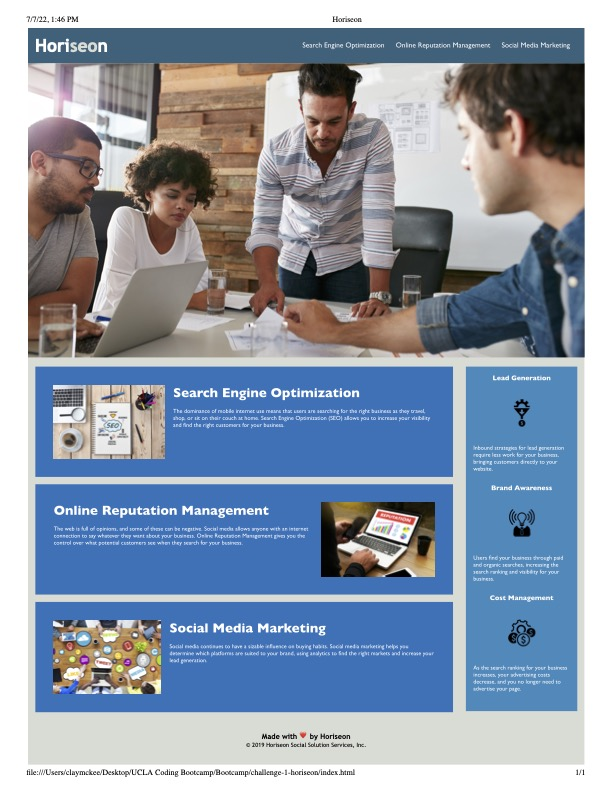

# Making Horiseon Accessible and Optimized for Search Engines

## Description

By using my knowledge of HTML, I altered the code to be more readible for search engines and for accessibility purposes by changing div tags to more specific markers, such as section, main, figure, etc. This allows for content to be better understood by browsers and computer programs. I also added alt captions to all images for screen readers or in case the images become unlinked. Finally, I cleaned up the HTML to make the code easier to follow by adding breaks between the various components of the webpage for easier viewing/interpreting. I, then, verified that the CSS was still working properly based on the changes that I made to the HTML file. Upon assuring that the website's aesthetics did not change, I simplified the CSS code by chaining together classes that had the same stylistic elements. Rather than three blocks of code for certain elements, I was able to group those classes under one block of code, making the code a bit easier to process and change (if the company would like to change the color of those elements in the future, for example, they would only have to change one piece of code rather than three separate).

## Credits

My source code was provided by Horiseon and their design team.

## Link

Live site: https://cmckee120993.github.io/challenge-1-horiseon/ 